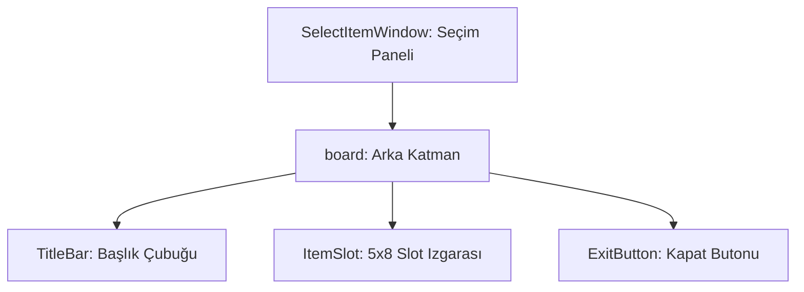

# 🎓 Metin2 Skills: `selectitemwindow.py` (Eşya Seçme Penceresi)

`selectitemwindow.py`, özellikle eşyalara taş ekleme (Metin taşı) veya belirli bir işlem için envanterden bir eşya seçilmesi gerektiğinde açılan yardımcı panelin tasarımıdır.

---

## 🔍 Neleri Yönetir?

### 1. Izgara Yapısı (`grid_table`)
Pencere içindeki eşya slotlarını bir tablo şeklinde yönetir.
- **`x_count: 5` / `y_count: 8`**: Toplamda 40 slotluk (5x8) bir alan oluşturur.
- **`x_step: 32` / `y_step: 32`**: Her bir slotun Metin2 standartı olan 32x32 piksel boyutunda olduğunu belirler.

### 2. Başlık Dinamiği (`TitleName`)
- **`text`**: Varsayılan olarak `uiScriptLocale.SELECT_METIN_STONE_TITLE` (Metin Taşı Seç) metnini kullansa da, bu pencere çok amaçlıdır ve kod tarafında başlığı değiştirilebilir.

### 3. Pencere Tarzı (`movable`, `float`)
Pencerenin fareyle sürüklenebilir olduğunu ve diğer pencerelerin üzerinde (float) kalacağını belirtir.

---

## 🛠️ Modifikasyon ve Kritik Uyarılar

### ✅ Slot Sayısını Artırma:
Daha fazla eşya gösterilmesi gerekiyorsa `y_count` değerini artırıp `height` (yükseklik) değerini de buna göre (her bir slot için +32px) güncellemelisiniz.

### ⚠️ Slot Arkaplanı:
`Slot_Base.sub` görseli slotların arkasındaki gri kutucukları oluşturur. Eğer özel bir tasarım kullanıyorsan bu yolu değiştirebilirsin.

---

## 📉 selectitemwindow.py Tasarım Hiyerarşisi

---

**Veri Akışı:** `ui.py (Grid Logic)` -> `uiselectitem.py` (Logic) -> `selectitemwindow.py` (Izgara Tasarımı) -> Ekran.
