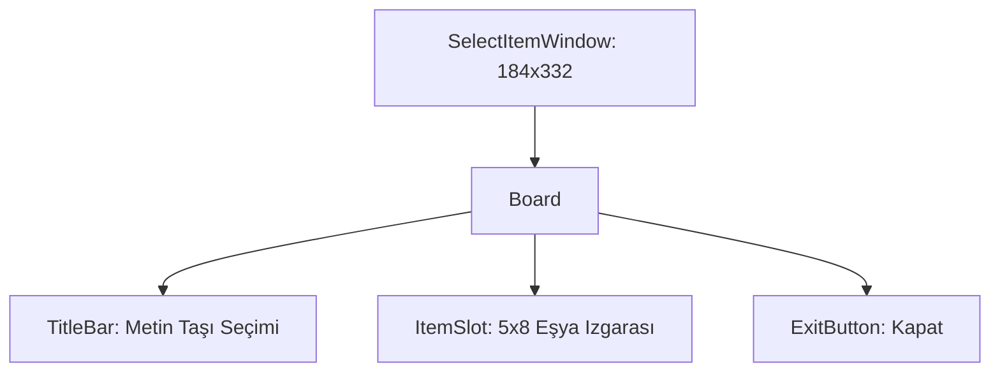

# 🎓 Metin2 Skills: `selectitemwindow.py` (Metin Taşı/Eşya Seçim Tasarımı)

`selectitemwindow.py`, bir silaha "Taş Ekleme" veya benzeri durumlarda, envanterdeki uygun taşların (veya eşyaların) listelendiği ayrı bir eşya seçim arayüzünün tasarımıdır.

---

## 🔍 Neleri Yönetir?

### 1. Eşya Izgarası (`ItemSlot`)
Tipik envanter veya depo pazar ızgarasıyla aynı yapıyı (`5x8`) kullanır. Taş Ekleme işlemine tıklandığında envanterdeki ruh taşları filtrelenerek bu ızgaraya yerleştirilir.

### 2. Başlık ve Kapatma
Seçim işlemi iptal edilmek istendiğinde kullanılacak `ExitButton` ve pencerenin amacını belirten dinamik başlık çubuğu (`TitleBar`) bulunur.

---

## 🛠️ Modifikasyon ve Kritik Uyarılar

### ✅ Izgara Boyutu:
Eğer `5x8` olan bu ızgara kapasitesini artırmak istersen `y_count` değerini büyütüp pencere yüksekliğini artırabilirsin. Ancak çoğu oyuncu aynı anda 40'tan fazla taşı üzerinde taşımaz.

## 📉 selectitemwindow.py Yapısı

