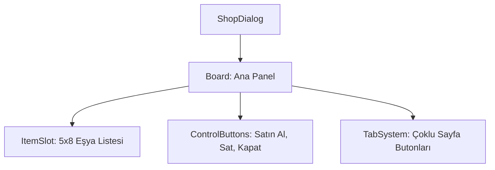

# 🎓 Metin2 Skills: `shopdialog.py` (NPC Market / Satın Alma Paneli)

`shopdialog.py`, oyuncunun bir NPC (Örn: Satıcı, Zırh Satıcısı) ile etkileşime girdiğinde veya bir başkasının pazarını açtığında karşılaştığı satın alma penceresidir.

---

## 🔍 Neleri Yönetir?

### 1. Market Izgarası (`ItemSlot`)
NPC'nin sattığı eşyaların listelendiği 5x8 boyutundaki ana tablodur.
- **`x_count: 5`, `y_count: 8`**: Toplam 40 adet eşya slotu barındırır.

### 2. İşlem Butonları (`BuyButton`, `SellButton`)
Oyuncunun market modunu değiştirmesini sağlar:
- **`BuyButton`**: Satın alma moduna geçer.
- **`SellButton`**: Envanterindeki eşyaları NPC'ye satma moduna geçer.

### 3. Sekme Yapısı (`SmallTab`, `MiddleTab`)
Bazı gelişmiş marketlerde (Örn: Birden fazla sayfası olan marketler) sayfalar arası geçişi sağlayan buton gruplarıdır. Standart marketlerde genellikle gizlidirler.

---

## 🛠️ Modifikasyon ve Kritik Uyarılar

### ✅ Market Kapasitesini Artırma:
Eğer bir NPC'nin 40'tan fazla eşya satmasını istiyorsan, `y_count` değerini artırmalı ve pencerenin `height` değerini buna göre uzatmalısın.

### ⚠️ Fiyat Etiketleri:
Bu pencere sadece eşyaları gösterir. Eşyaların fiyat bilgisi (`Yang`) üzerine gelindiğinde `root/uitooltip.py` tarafından gösterilir.

---

## 📉 shopdialog.py Tasarım Hiyerarşisi

---

**Veri Akışı:** `Server (Shop Packet)` -> `root/uishop.py` -> `shopdialog.py` -> Ekran.
