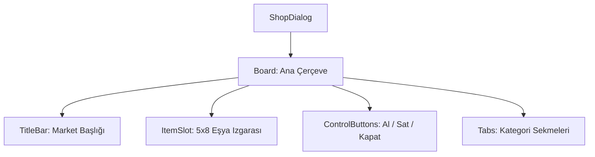

# 🎓 Metin2 Skills: `shopdialog.py` (NPC Market Tasarımı)

`shopdialog.py`, Satıcı, Silah Satıcısı gibi NPC'lerin market penceresinin nasıl görüneceğini, kaç adet eşya alabileceğini ve sekmelerin yerlerini belirleyen tasarım dosyasıdır.

---

## 🔍 Neleri Yönetir?

### 1. Market Izgarası (`ItemSlot`)
NPC'nin sattığı eşyaların dizildiği alanı yönetir. Standart olarak 5x8 (40 slot) boyutundadır.
- **`x_count`**: Sütun sayısı (Yan yana kaç eşya).
- **`y_count`**: Satır sayısı (Üst üste kaç eşya).

### 2. Satın Al ve Sat Butonları (`BuyButton` & `SellButton`)
Oyuncunun marketten eşya alırken veya markete eşya satarken kullandığı mod değiştirme butonlarını yönetir.

### 3. Çoklu Sekme Desteği (`SmallTab` & `MiddleTab`)
Eğer bir NPC birden fazla kategoride eşya satıyorsa (Örn: Market -> Potlar, Malzemeler), bu sekmeler arasında geçiş yapılmasını sağlayan butonların yerlerini belirler.

### 4. Kapat Butonu (`CloseButton`)
Pencerenin en altında bulunan ve marketi kapatmaya yarayan geniş butonun tasarımını ve konumunu yönetir.

---

## 🛠️ Modifikasyon ve Kritik Uyarılar

### ✅ Market Kapasitesini Artırma:
Daha fazla eşya göstermek için `x_count` veya `y_count` değerlerini artırabilirsin. Ancak bunu yaparken `board` (Ana çerçeve) genişliğini ve yüksekliğini de büyütmeyi unutmamalısın.

### ✅ Sekme Sayısını Düzenleme:
Yeni bir kategori eklemek istersen `SmallTab4` gibi yeni bir `radio_button` tanımı ekleyerek marketi daha düzenli hale getirebilirsin.

### ⚠️ Buton Üst Üste Binmesi:
Market penceresi dar olduğu için butonlar (`Buy`, `Sell`, `Close`) bazen birbirinin üzerine binebilir. Koordinatları (`x`, `y`) milimetrik olarak ayarlamak önemlidir.

---

## 🚨 Hata Ayıklama (Debug)

**"Market penceresi çok küçük, eşyalar dışarı taşıyor" sorunu:**
1.  `ItemSlot` içindeki `x_count` ve `y_count` değerleri ile `board` penceresinin `width` ve `height` değerlerinin uyumlu olup olmadığını kontrol et. Her slot 32 piksel yer kaplar.

---

## 📉 shopdialog.py Katman Şeması

---

**Sonuç:** `shopdialog.py`, oyun içi ticaretin temelidir. Sade ve işlevsel bir market tasarımı, oyuncuların ihtiyaç duydukları eşyalara hızlıca ulaşmasını sağlar.
