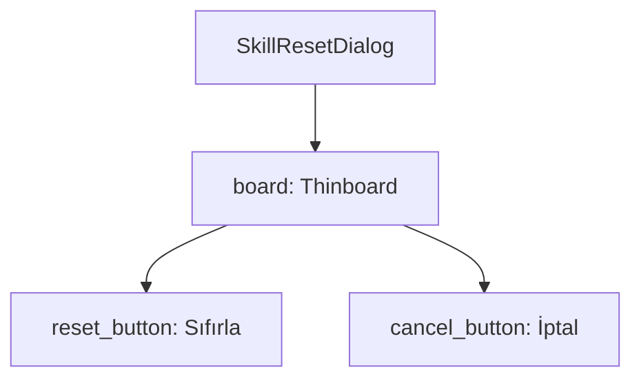

# 🎓 Metin2 Skills: `skillpointresetdialog.py` (Beceri Sıfırlama)

`skillpointresetdialog.py`, oyuncunun becerilerini (Skill) sıfırlamak istediğinde karşısına çıkan onay ve seçim penceresidir.

---

## 🔍 Neleri Yönetir?

### 1. Butonlar (`reset_button`, `cancel_button`)
Kullanıcının işlemi onaylaması veya iptal etmesi için gereken iki ana butonu tanımlar.
- **`XLarge_Button`**: Standart butonlara göre daha geniş olan görsel tipini kullanır.

### 2. Konumlandırma
Pencere, `SCREEN_WIDTH/2 - 100` formülüyle ekranın yatay merkezine tam olarak oturtulmuştur.

---

## 🛠️ Modifikasyon ve Kritik Uyarılar

### ✅ Metin Düzenleme:
Dosya içindeki `text` kısımları bozuk karakterli görünebilir (Encoding kaynaklı). Bunları `uiScriptLocale` üzerinden bir değişkene bağlamak veya düzgün Türkçe karakterlerle yazmak görseli iyileştirir.

### ⚠️ Buton Aralığı:
İki buton arasında 40 piksellik (`y: 17` ve `y: 57`) bir dikey boşluk bırakılmıştır. Bu boşluk, butonların birbirine girmesini engeller ve dokunmatik ekranlar (Veya hızlı fare hareketleri) için ergonomi sağlar.

---

## 📉 skillpointresetdialog.py Tasarım Hiyerarşisi

---

**Veri Akışı:** `root/uipointreset.py` -> `skillpointresetdialog.py` -> Ekran.
