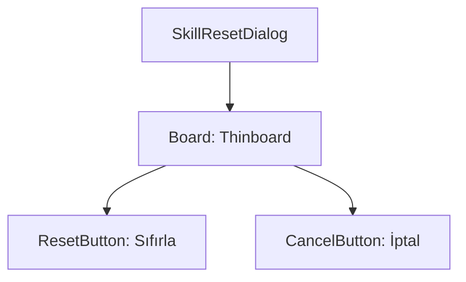

# 🎓 Metin2 Skills: `skillpointresetdialog.py` (Beceri Sıfırlama Onayı)

`skillpointresetdialog.py`, oyuncu bir "Beceri Sıfırlama Kağıdı" kullandığında veya bir NPC üzerinden tek bir beceriyi sıfırlamak istediğinde açılan küçük onay penceresidir.

---

## 🔍 Neleri Yönetir?

### 1. Sıfırlama Butonu (`reset_button`)
Seçili olan becerinin puanlarını geri alıp, puanları tekrar dağıtılabilir hale getiren ana işlemdir.

### 2. İptal Butonu (`cancel_button`)
İşlemi gerçekleştirmeden pencereyi kapatır.

### 3. İnce Panel (`thinboard`)
Pencere, ekranın tam ortasında (`SCREEN_WIDTH/2 - 100`) açılan ve yer kaplamayan bir `thinboard` yapısına sahiptir.

---

## 🛠️ Modifikasyon ve Kritik Uyarılar

### ✅ Buton Metinleri:
Dosya içindeki garip karakterler (`Џג`) aslında yerel dil dosyalarındaki (Örn: `uiScriptLocale.OK`) karşılıkları temsil eder. Modifiye ederken bu metinleri doğrudan `uiScriptLocale` değişkenlerine bağlamak daha temiz bir yapı sağlar.

### ⚠️ Kod Bağlantısı:
Bu pencere tetiklendiğinde hangi becerinin sıfırlanacağı bilgisi `root/uipointreset.py` tarafından yönetilir.

---

## 📉 skillpointresetdialog.py Tasarım Hiyerarşisi

---

**Veri Akışı:** `Eşya Kullanımı` -> `root/uipointreset.py` -> `skillpointresetdialog.py` -> `Server (Reset Packet)`.
