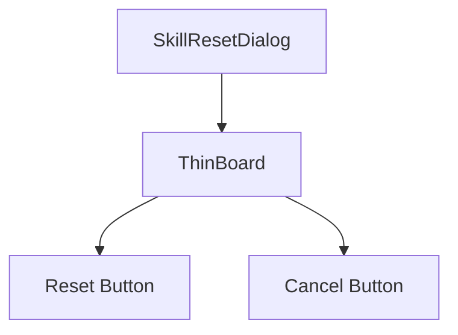

# 🎓 Metin2 Skills: `skillpointresetdialog.py` (Beceri Puanı Sıfırlama)

`skillpointresetdialog.py`, Yaşlı Kadın NPC'sine veya statü sıfırlama eşyalarına tıklandığında açılan, statü/beceri puanlarının sıfırlanmasını onaylayan penceredir.

---

## 🔍 Neleri Yönetir?

### 1. İnce Çerçeve (`thinboard`)
Tipik NPC/Görev pencereleri gibi arka planında şeffaf ince bir çerçeve kullanılır.

### 2. Onay Butonları
- **`reset_button`**: Sıfırlama işlemini kabul et.
- **`cancel_button`**: İşlemden vazgeç.

---

## 🛠️ Modifikasyon ve Kritik Uyarılar

### ⚠️ Kodlama (Encoding) Sorunu:
Dosya içerisinde buton isimleri (Örn: `"Џג "`) bozuk Korece karakterler olarak görünüyor. Bu aslında `uiScriptLocale` üzerinden çekilmek yerine doğrudan `.py` içine yazıldığı için Metin2 client'ında bazen bozuk karakterlere yol açabilir. Çeviri sistemi (`locale`) ile değiştirmek en iyisidir.

## 📉 skillpointresetdialog.py Yapısı

