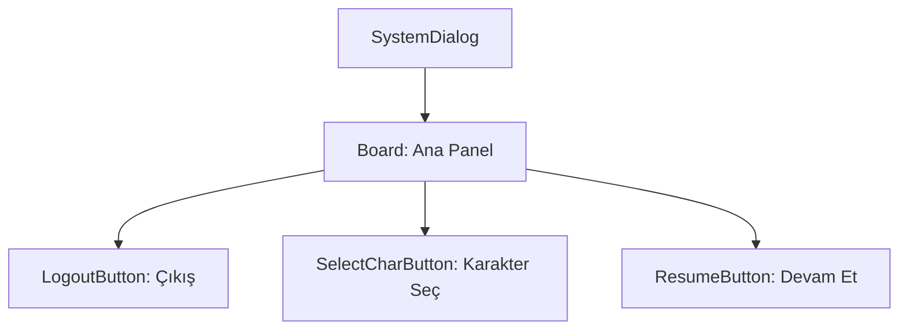

# 🎓 Metin2 Skills: `systemdialog.py` (Çıkış Menüsü Tasarımı)

`systemdialog.py`, ESC tuşuna basıldığında açılan ve "Oyunu Kapat", "Karakteri Değiştir", "İptal" gibi seçenekleri sunan sistem menüsünün tasarım dosyasıdır.

---

## 🔍 Neleri Yönetir?

### 1. Çıkış Butonları
- **Oyundan Çık**: İstemciyi tamamen kapatır.
- **Karakter Seç**: Karakter seçim ekranına döner.
- **Devam Et**: Menüyü kapatıp oyuna geri döner.

### 2. Varyasyonlar
Bu dosyanın `systemdialog_formall.py` (Nesne Market) ve `systemdialog_forportal.py` (Portal) gibi özel durumlar için modifiye edilmiş versiyonları da mevcuttur.

---

## 🛠️ Modifikasyon ve Kritik Uyarılar

### ✅ Yeni Buton Ekleme:
"Ayarlar" veya "Yardım" gibi kısayol butonları ekleyerek ESC menüsünü zenginleştirebilirsin.

### ⚠️ Buton İsimleri:
`uiSystem.py` dosyasındaki kod bu butonların isimlerini (`name`) kullanır. İsim değişirse butonlar çalışmaz.

---

## 📉 systemdialog.py Yapısı

**Sonuç:** `systemdialog.py`, oyuncunun "Acil Çıkış Kapısı"dır. Sade ve güvenilir bir ESC menüsü kritik öneme sahiptir.
