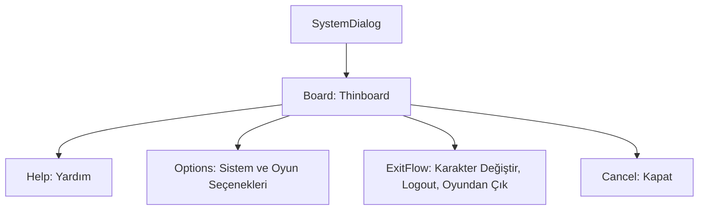

# 🎓 Metin2 Skills: `systemdialog.py` (Sistem Menüsü - ESC)

`systemdialog.py`, oyuncu oyun içindeyken **ESC** tuşuna bastığında açılan ana kontrol panelidir. Oyun ayarlarından çıkış işlemlerine kadar tüm sistem komutları burada toplanır.

---

## 🔍 Neleri Yönetir?

### 1. Ayar Butonları
- **`system_option_button`**: Ses ve görüntü ayarlarını açar.
- **`game_option_button`**: Oyun içi (PVP modu, isim gösterme vb.) seçenekleri açar.

### 2. Çıkış ve Geçiş Butonları
- **`change_button`**: Karakter seçme ekranına geri döner (Karakter değiştir).
- **`logout_button`**: Hesaptan tamamen çıkış yapıp giriş ekranına döner.
- **`exit_button`**: Oyunu tamamen kapatır.

### 3. Yardım ve İptal
- **`help_button`**: Oyun rehberini açar.
- **`cancel_button`**: ESC menüsünü kapatıp oyuna döner.

---

## 🛠️ Modifikasyon ve Kritik Uyarılar

### ✅ Menüye Yeni Özellik Ekleme:
Eğer sunucuna özel bir menü (Örn: "Nesne Market" veya "Hızlı Kanal Değiştirme") eklemek istiyorsan, bu dosyaya yeni bir buton ekleyebilir ve `root/uisystem.py` üzerinden bu butona fonksiyon atayabilirsin.

### ⚠️ Dikey Yerleşim:
Butonlar `y: 17`, `57`, `87` gibi değerlerle dikey bir liste şeklinde hizalanmıştır. Yeni bir buton eklediğinde bu aralıkları (`30` piksel fark) koruman düzenli bir görünüm sağlar.

---

## 📉 systemdialog.py Tasarım Hiyerarşisi

---

**Veri Akışı:** `Oyuncu ESC` -> `root/uisystem.py` -> `systemdialog.py`.
