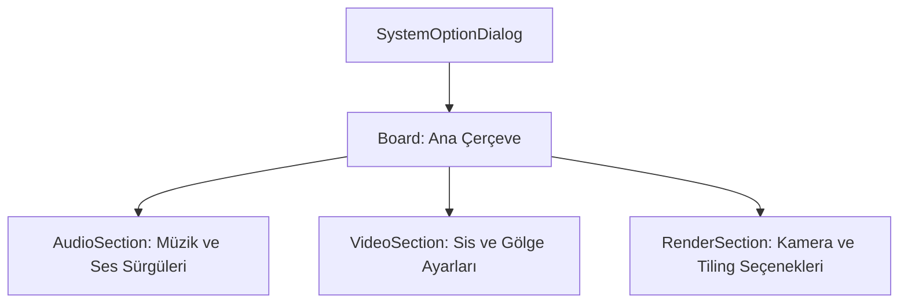

# 🎓 Metin2 Skills: `systemoptiondialog.py` (Sistem Seçenekleri)

`systemoptiondialog.py`, oyunun ses (Müzik/Efekt), görüntü (Sis, Kamera, Gölge) ve grafik işleme (Tiling) ayarlarının yapıldığı kontrol panelidir.

---

## 🔍 Neleri Yönetir?

### 1. Ses ve Müzik Kontrolü (`sliderbar`)
- **`music_volume_controller` / `sound_volume_controller`**: Ses seviyelerini ayarlayan kaydırma çubuklarıdır.
- **`bgm_button`**: Oyun içi müziği değiştirmek için `musiclistwindow`'u tetikleyen butondur.

### 2. Görsel Ayarlar (`radio_button`)
- **`camera_mode`**: Kameranın ne kadar uzağa (`Short/Long`) gidebileceğini ayarlar.
- **`fog_mode`**: Oyun dünyasındaki sis yoğunluğunu (`Dense/Middle/Light`) belirler.
- **`shadow_mode`**: Gölgelerin kalitesini veya varlığını bir sürgü ile yönetir.

### 3. Grafik İşleme (`tiling_mode`)
- **`tiling_cpu / tiling_gpu`**: Zemin dokularının CPU mu yoksa Ekran Kartı (GPU) üzerinden mi işleneceğini belirler. Bu ayar, düşük performanslı bilgisayarlar için kritiktir.

---

## 🛠️ Modifikasyon ve Kritik Uyarılar

### ✅ Kamera Sınırını Esnetme:
Kameranın çok daha uzağı görmesini istiyorsan, `camera_long` butonunun işlevini `root/uisystemoption.py` içinden daha yüksek bir sayısal değere bağlayabilirsin.

### ⚠️ Grafik Değişikliği Uyarısı:
Tiling modunda yapılan değişikliklerin aktif olması için `tiling_apply` butonuna basılması gerekir. Bazı sunucularda bu ayarın değişmesi oyunun yeniden başlatılmasını gerektirebilir.

---

## 📉 systemoptiondialog.py Tasarım Hiyerarşisi

---

**Veri Akışı:** `root/uisystemoption.py` -> `systemoptiondialog.py` -> `İstemci Ayar Dosyası (metin2.cfg)`.
