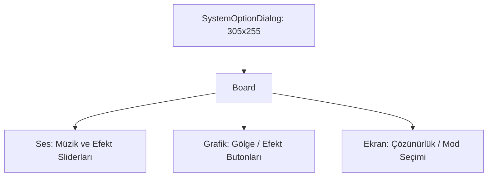

# 🎓 Metin2 Skills: `systemoptiondialog.py` (Sistem Ayarları Tasarımı)

`systemoptiondialog.py`, müzik/ses seviyesi, çözünürlük, gölge kalitesi ve diğer teknik ayarların yapıldığı "Sistem Seçenekleri" penceresinin tasarım dosyasıdır.

---

## 🔍 Neleri Yönetir?

### 1. Ses ve Müzik Ayarları
Arka plan müziği (BGM) ve efekt sesi (SFX) için kaydırma çubukları (Slider) veya butonların yerleşimini belirler.

### 2. Grafik Kalitesi
Gölge seviyesi, efekt yoğunluğu ve sis mesafesi gibi performansı etkileyen ayar satırlarını yönetir.

### 3. Ekran Ayarları
Pencereli/Tam ekran modu ve çözünürlük seçeneklerinin sunulduğu buton gruplarını düzenler.

### 4. Matematik Tabanlı Hizalama
`TEMPORARY_X`, `TEXT_TEMPORARY_X` gibi ofset sabitleri kullanılarak tüm etiketler ve butonlar düzgün sütunlar halinde hizalanır.

---

## 🛠️ Modifikasyon ve Kritik Uyarılar

### ✅ Yeni Ayar Ekleme:
Örneğin "FPS Sınırlayıcı" gibi bir seçenek eklemek istersen, mevcut son satırın `y` değerine 25 ekleyerek yeni bir satır oluşturabilirsin.

### ⚠️ Slider Senkronizasyonu:
Ses kaydırma çubukları `uiSystemOption.py` koduyla bağlantılıdır. Butonların `name` değerlerini değiştirirsen ses kontrolleri çalışmaz.

---

## 📉 systemoptiondialog.py Yapısı

---

**Sonuç:** `systemoptiondialog.py`, oyuncunun "Teknik Kontrol Merkezi"dir. Performans ve konfor arasındaki dengeyi bu pencereden ayarlar.
