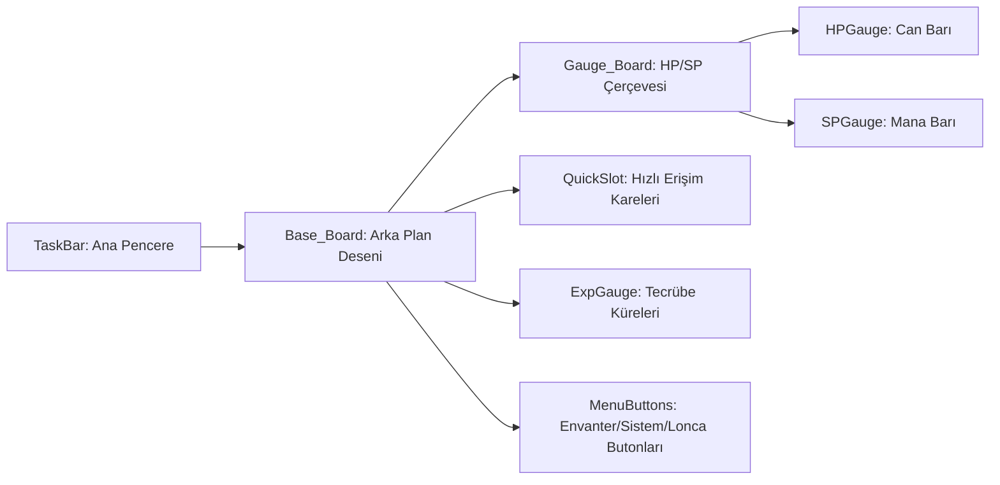

# 🎓 Metin2 Skills: `taskbar.py` (Görev Çubuğu Tasarımı)

`taskbar.py`, ekranın en altında bulunan ve HP/SP barlarını, hızlı erişim slotlarını (1-4, F1-F4) ve ana menü butonlarını barındıran "Görev Çubuğu"nun tasarım dosyasıdır.

---

## 🔍 Neleri Yönetir?

### 1. Dinamik Genişlik (`expanded_image`)
Oyun penceresi ne kadar geniş olursa olsun (`SCREEN_WIDTH`), alt barın arka planının ekranı tam kaplamasını sağlayan esnek yapıyı yönetir.

### 2. Yaşam ve Enerji Barları (`HPGauge` & `SPGauge`)
Can (HP) ve Mana (SP) değerlerini gösteren renkli barların konumlarını ve dolma animasyonlarını (`ani_image`) belirler.

### 3. Hızlı Erişim Slotları (`QuickSlot`)
Oyuncuların iksir veya yetenek sürükleyip bıraktığı 1, 2, 3, 4 ve F1, F2, F3, F4 tuşlarına bağlı karelerin yerlerini belirler.

### 4. Tecrübe Küreleri (`ExpGauge`)
Ekranın sol altında bulunan ve karakter seviye atladıkça dolan 4 adet tecrübe (EXP) küresinin koordinatlarını ve görsellerini yönetir.

---

## 🛠️ Modifikasyon ve Kritik Uyarılar

### ✅ Yeni Hızlı Slotlar Ekleme:
Standart 4 slot yerine 8 veya 12 slotluk geniş bir taskbar yapmak istiyorsan, `QuickSlot` genişliğini artırmalı ve yeni slot koordinatları eklemelisin.

### ✅ Gauge Renk Değişimi:
Can barının kırmızı yerine yeşil, Mana barının mavi yerine mor görünmesini istiyorsan, `images` listesindeki `.sub` dosyalarını değiştirebilirsin.

### ⚠️ Koordinat Senkronizasyonu:
Taskbar'ın yüksekliği (`height : 37`) değişirse, üzerindeki tüm objelerin (HP barı, butonlar vb.) `y` koordinatlarını da tek tek yukarı veya aşağı kaydırman gerekir.

---

## 🚨 Hata Ayıklama (Debug)

**"Taskbar ekranın ortasında duruyor" sorunu:**
1.  Ana pencerenin `y` koordinatını kontrol et. `SCREEN_HEIGHT - 37` şeklinde olmalıdır. Eğer sadece bir sayı yazıldıysa (Örn: 600), farklı çözünürlüklerde taskbar havada kalabilir.

---

## 📉 taskbar.py Görsel Katmanları

---

**Sonuç:** `taskbar.py`, oyuncunun "Hayatta Kalma Göstergesidir". Her an göz önünde olan bu panelin tasarımı, oyunun akıcılığı için çok önemlidir.
