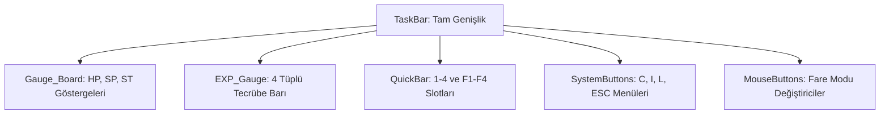

# 🎓 Metin2 Skills: `taskbar.py` (Görev Çubuğu - HUD)

`taskbar.py`, ekranın en altında yer alan ve oyuncunun can (HP), enerji (SP), tecrübe (EXP) durumlarını izlediği, yetenek kısayollarını kullandığı ve ana menülere ulaştığı merkezi kontrol çubuğudur.

---

## 🔍 Neleri Yönetir?

### 1. Durum Göstergeleri (Gauges)
- **`HPGauge` / `SPGauge`**: Can ve mana seviyelerini gösteren animasyonlu (`ani_image`) çubuklardır. `01.tga`'dan `07.tga`'ya kadar olan karelerle su dalgalanması efekti verilir.
- **`EXP_Gauge_Board`**: Dört küçük tüpten (`EXPGauge_01-04`) oluşan tecrübe göstergesidir. Her tüp %25 tecrübeyi temsil eder.

### 2. Kısayol Slotları (`QuickBar`)
- **`quick_slot_1` (1, 2, 3, 4)** ve **`quick_slot_2` (F1, F2, F3, F4)**: Oyuncunun iksir veya beceri sürüklediği 8 adet ana kısayol slotudur.
- **`QuickPageUp/Down`**: Kısayol sayfaları (1, 2, 3, 4) arasında geçiş yapmayı sağlar.

### 3. Sistem Butonları
Ekranın sağ en köşesinde bulunan hızlı erişim butonlarıdır:
- **Karakter (C)**, **Envanter (I)**, **Messenger (L)**, **Sistem (ESC)**.

---

## 🛠️ Modifikasyon ve Kritik Uyarılar

### ✅ Yeni Buton Ekleme:
Taskbar'a yeni bir özellik (Örn: "Otomatik Av") butonu eklemek istersen, `CharacterButton` koordinatlarını referans alarak yeni bir buton bloğu ekleyebilirsin. `Y_ADD_POSITION` değişkeni ekran çözünürlüğüne göre dikey hizalamayı korur.

### ⚠️ Görsel Kaynaklar:
Taskbar görselleri (`exp_gauge.sub`, `mouse_button_move.sub` vb.) `pack/ETC` içindeki `taskbar/` klasöründen çekilir. Bu görselleri değiştirirken şeffaflık (Alpha) ayarlarına dikkat edilmelidir.

---

## 📉 taskbar.py Tasarım Hiyerarşisi

---

**Veri Akışı:** `root/uitaskbar.py` -> `taskbar.py` -> Ekran.
