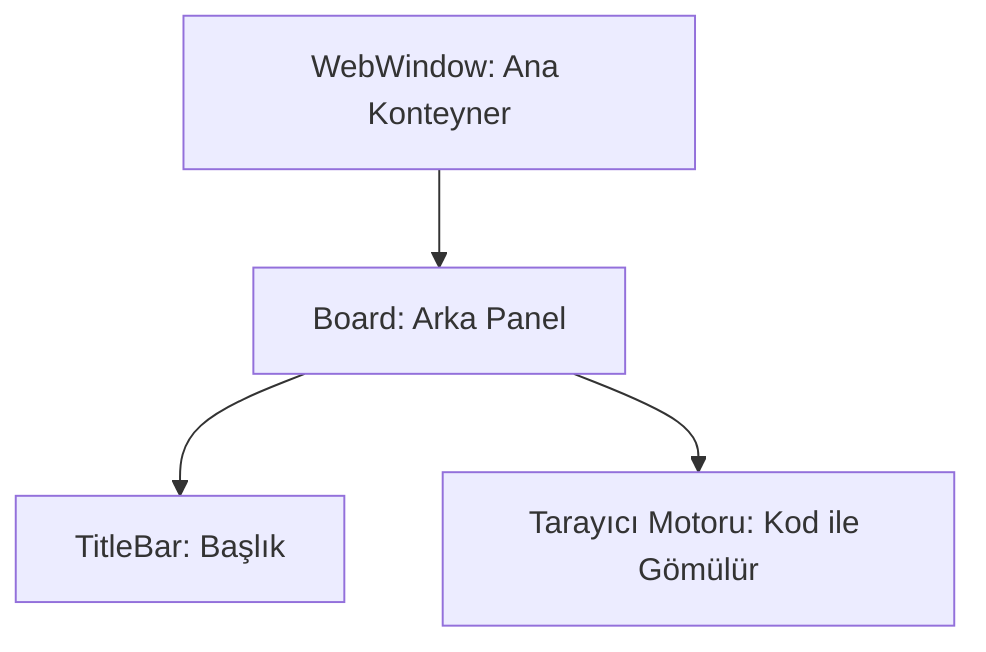

# 🎓 Metin2 Skills: `webwindow.py` (Nesne Market - Web Tarayıcısı)

`webwindow.py`, oyun içinde açılan Nesne Market (Item Shop) veya anketler gibi web tabanlı içerikleri görüntüleyen pencerenin dış çerçevesidir.

---

## 🔍 Neleri Yönetir?

### 1. Pencere Boyutları (`WEB_WIDTH`, `WEB_HEIGHT`)
Metin2'nin dahili tarayıcısının (Internet Explorer tabanlı) hangi boyutlarda (Genellikle 640x480) görüntüleneceğini belirler.

### 2. Başlık Barı (`TitleBar`)
Pencerenin en üstünde yer alan ve "Nesne Market" (`SYSTEM_MALL`) başlığını taşıyan alanı yönetir.

### 3. Kabuk Yapısı (Shell)
Bu dosya sadece bir "çerçeve"dir. Tarayıcının kendisi (Web sayfası), `root/uiweb.py` üzerinden bu pencerenin içine gömülür (Embed).

---

## 🛠️ Modifikasyon ve Kritik Uyarılar

### ✅ Tam Ekran Web:
Eğer Nesne Marketin daha büyük görünmesini istiyorsan `WEB_WIDTH` ve `WEB_HEIGHT` değerlerini artırabilirsin. Ancak web sayfasının bu yeni çözünürlüğe (Responsive) uyumlu olması gerekir.

### ⚠️ IE Bağımlılığı:
Metin2 motoru, bu pencere içinde Windows'un yüklü olan Internet Explorer motorunu kullanır. Eğer oyuncunun bilgisayarında IE ayarları bozuksa bu pencere boş veya hatalı görünebilir.

---

## 📉 webwindow.py Tasarım Hiyerarşisi

---

**Veri Akışı:** `root/uiweb.py` -> `webwindow.py` -> `OS (IE Engine)`.
