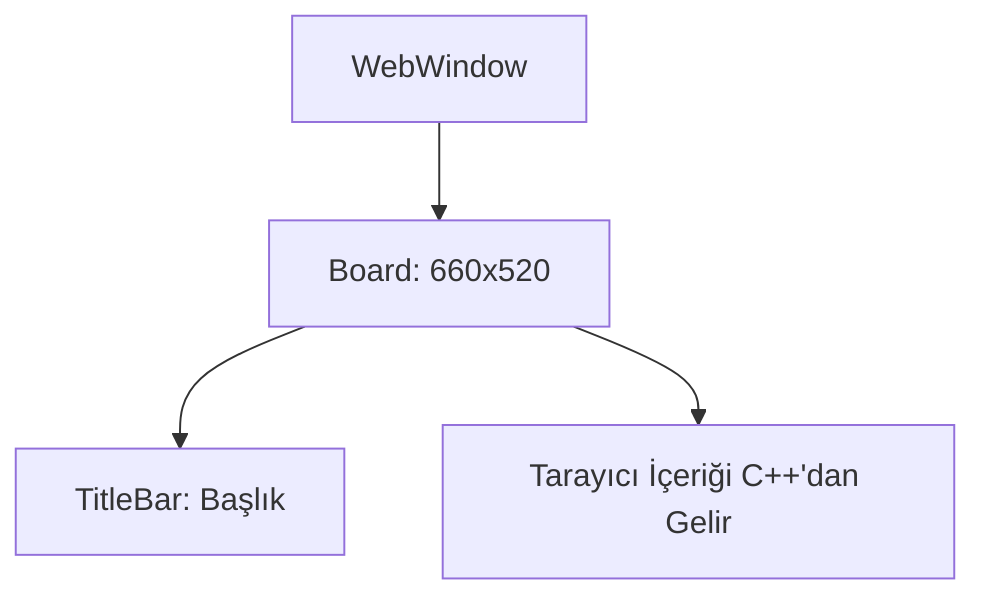

# 🎓 Metin2 Skills: `webwindow.py` (Oyun İçi Tarayıcı)

`webwindow.py`, oyun içerisinde bir web sayfasını açmak için (Örn: Nesne Market, Duyurular, Şifre Değiştirme) kullanılan gömülü tarayıcı arayüzünün tasarımıdır.

---

## 🔍 Neleri Yönetir?

### 1. Pencere Boyutları
İçeriğin rahat okunabilmesi için varsayılan olarak `640x480` (`WEB_WIDTH` ve `WEB_HEIGHT`) boyutlarında bir alan ayırır. Ancak Python tarafından bu boyutlar dinamik olarak büyütülüp küçültülebilir.

### 2. İsim Karmaşası (`name : "MallWindow"`)
Burada ilginç bir detay var: `name` parametresi `"MallWindow"` olarak bırakılmış. Daha önceki `mallwindow.py` dosyası ile aynı isme sahip. Bu, motorun web sayfalarını genellikle nesne market için kullanmasından kaynaklanan klasik bir tasarım kodlamasıdır.

---

## 🛠️ Modifikasyon ve Kritik Uyarılar

### ⚠️ Web Çekirdeği:
Bu dosya sadece çerçevenin dış görünümünü (Pencere sınırı ve Başlık) belirler. İçeriğe web sitesinin render edilmesi, oyun motorunun C++ tarafındaki tarayıcı kütüphanesine (genellikle çok eski bir IE/Webkit sürümü) bağlıdır.

## 📉 webwindow.py Yapısı

