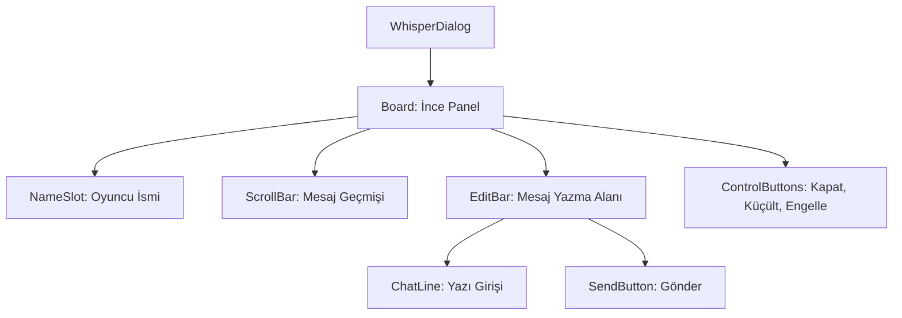

# 🎓 Metin2 Skills: `whisperdialog.py` (Fısıltı - Özel Mesaj)

`whisperdialog.py`, oyuncuların birbirleriyle özel olarak mesajlaşmasını sağlayan "Fısıltı" penceresinin tasarım dosyasıdır.

---

## 🔍 Neleri Yönetir?

### 1. Mesajlaşma Alanı (`chatline`)
Kullanıcının mesajını yazdığı `editline` alanıdır.
- **`multi_line : 1`**: Uzun mesajların alt satıra geçmesine izin verir.
- **`input_limit : 40`**: Bir kerede gönderilebilecek maksimum karakter sınırıdır.

### 2. GM İşareti (`gamemastermark`)
Eğer mesaj bir Game Master (GM) tarafından geliyorsa, ismin yanında görünen özel logoyu (`ymirred.tga`) yönetir.

### 3. Kontrol Butonları
- **`ignorebutton`**: Oyuncuyu engellemek için kullanılır.
- **`minimizebutton`**: Pencereyi ekranın sol altına küçültür.
- **`sendbutton`**: Yazılan mesajı iletir.

### 4. Kaydırma Çubuğu (`scrollbar`)
Geçmiş mesajlar arasında gezinmeyi sağlayan `thin_scrollbar` yapısını barındırır.

---

## 🛠️ Modifikasyon ve Kritik Uyarılar

### ✅ Tasarım ve Renk:
`editbar` içindeki `color` değeri (`0x77000000`) mesaj yazma alanının şeffaf siyah olmasını sağlar. Bu değeri değiştirerek arka plan rengini özelleştirebilirsin.

### ⚠️ Limit Genişliği:
`limit_width` değeri, yazının kutu dışına taşmadan ne kadar genişleyebileceğini belirler. Pencereyi büyütürsen bu değeri de artırmalısın.

---

## 📉 whisperdialog.py Tasarım Hiyerarşisi

---

**Veri Akışı:** `root/uiwhisper.py` -> `whisperdialog.py` -> `Server (Whisper Packet)`.
