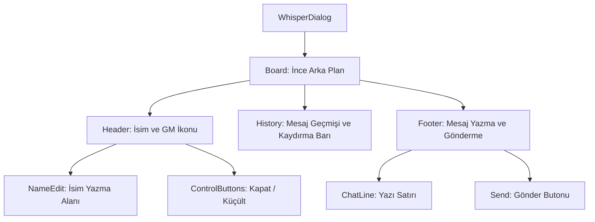

# 🎓 Metin2 Skills: `whisperdialog.py` (Fısıltı Penceresi Tasarımı)

`whisperdialog.py`, oyuncuların birbirlerine attığı özel mesajların (PM/Fısıltı) ekran yerleşimini, yazı yazma alanını ve butonlarını yöneten tasarım dosyasıdır.

---

## 🔍 Neleri Yönetir?

### 1. İsim Paneli (`name_slot`)
Mesajlaşılan kişinin isminin göründüğü ve yeni bir fısıltı başlatırken isim yazılan (`titlename_edit`) alanı yönetir.

### 2. Yazı Yazma Alanı (`editbar`)
Pencerenin alt kısmında bulunan, mesajın yazıldığı siyah arka planlı alanı ve içindeki `chatline` (metin giriş satırı) bileşenini belirler.

### 3. Yönetici İşareti (`gamemastermark`)
Eğer bir Game Master (GM) ile konuşuluyorsa, ismin yanında çıkan özel logonun konumunu ve ölçeğini (`x_scale`, `y_scale`) yönetir.

### 4. Engelleme ve Raporlama Butonları
Taciz durumlarını önlemek için kullanılan "Engelle" (`ignorebutton`) ve "Rapor Et" butonlarının yerleşimini sağlar.

---

## 🛠️ Modifikasyon ve Kritik Uyarılar

### ✅ Emoji ve Hızlı Yanıt Desteği:
`sendbutton` yanına yeni küçük butonlar ekleyerek "Emoji" seçici veya hazır mesaj kalıpları (Örn: "Selam", "Kaç Lv?") ekleyebilirsin.

### ✅ Pencere Boyutunu Artırma:
Özellikle uzun sohbetlerde yazıları daha rahat okumak için pencerenin `height` değerini artırabilir, `scrollbar` boyutunu buna göre güncelleyebilirsin.

### ⚠️ Metin Sınırı (`input_limit`):
`chatline` içindeki `input_limit` değeri, tek seferde gönderilebilecek karakter sayısını belirler. Bunu çok artırırsan sunucu tarafındaki paket sınırı nedeniyle mesajlar kesilebilir.

---

## 🚨 Hata Ayıklama (Debug)

**"Yazdığım yazılar kutunun dışına taşıyor" sorunu:**
1.  `chatline` içindeki `limit_width` değerini kontrol et. Bu değer, yazının genişliğinin pencere genişliğini (`width`) aşmamasını sağlar.
2.  `multi_line` özelliğinin aktif olduğundan emin ol.

---

## 📉 whisperdialog.py Katman Düzeni

---

**Sonuç:** `whisperdialog.py`, oyunun "Özel Mesajlaşma" arayüzüdür. Oyuncular arasındaki birebir iletişimin düzenini ve konforunu bu dosya belirler.
